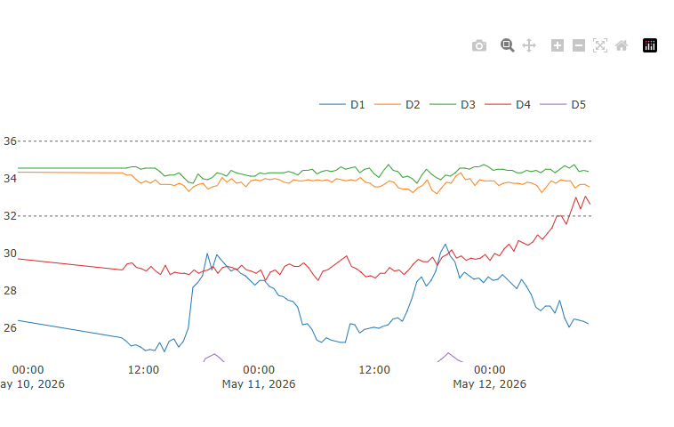
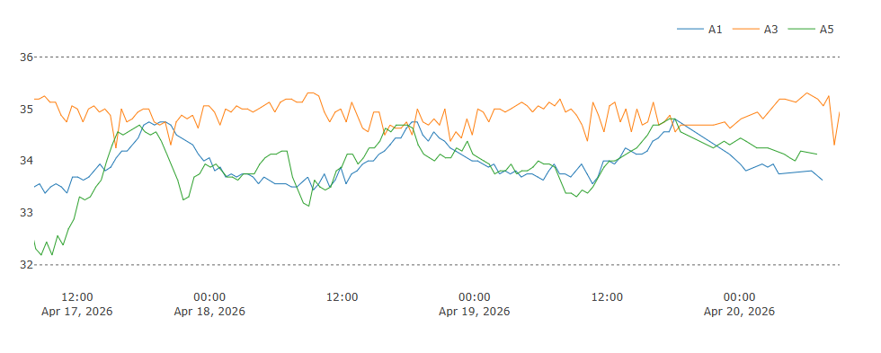
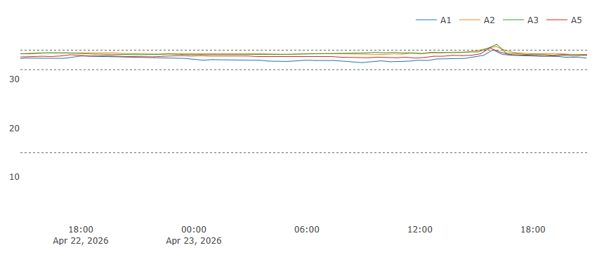

# Temperatura en la colmena
## Observaciones y notas

### 12 de mayo 202 (D)

En D4 empieza a subir la temperatur. Un subida asi puede ser porque lo esn llenado de miel o porque empiece a poner huevos la reina. Pero como este calentón ocurre por la noche lo mas seguro es que se esté reanudando la puesta. Comprobar en unso días...

### 22 abril 2026 (A)

Mientras en A1 y A5 desciende la temperatura aunque siempre en la zona de la cría A3 se mantiene mas alta. 
¿La diferencia es la presencia de cría abierta ?**NO**, A3 no tiene críabierta; solo operculada.

La única cosa especial que he notado es que esta colmena está haciendo realeras en el borde de la colmena, pero muy lejos del sensor. **¿Será que está la reina por ahí?, ¿Será un predictor de la enjambrazón?**

Va a ejambrar porque aunque las abejas tienen espacio de sobra **LA REINA NO TIENE DONDE PONER**!! por el excluidor 

### 23 abril 2026 (A)

¿Por qué sube la temperatura > 36ºC en toda la colmena? Este día no la he abierto, y no es externo porque en C ni en B se aprecia. Es algo de la colonia *itself*