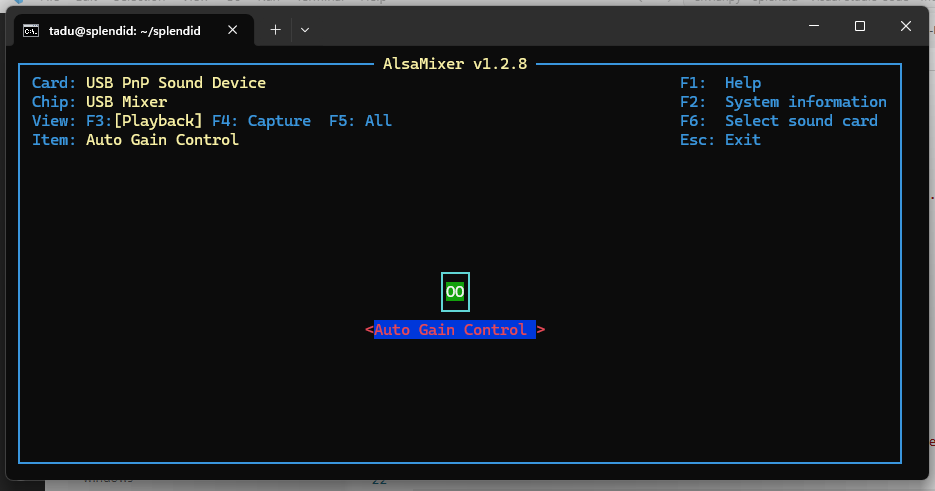
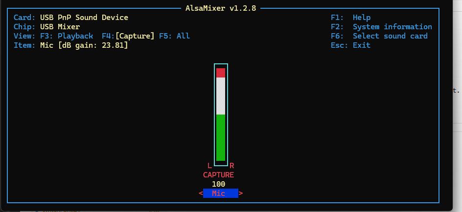

# Tareas

- [ ] Meter otro switch para apagado y enviar
- [ ] Pitar al terminar de enviar

# ¿Qué puede salir MAL?

- [ ] que el volumen ambiente sea demasiado alto y no se silencie
- [ ] que en el servidor coincidan los nombre cuando no hay internet.

Configuracio del micrófono 

> alsamixer

(F4 para seleccionar la tarjeta de sonido, en este caso USB PnP Sound Device)

